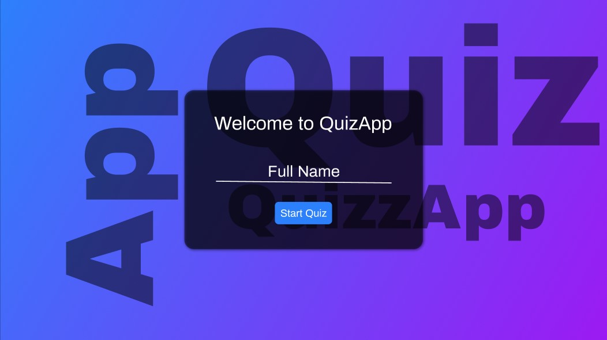
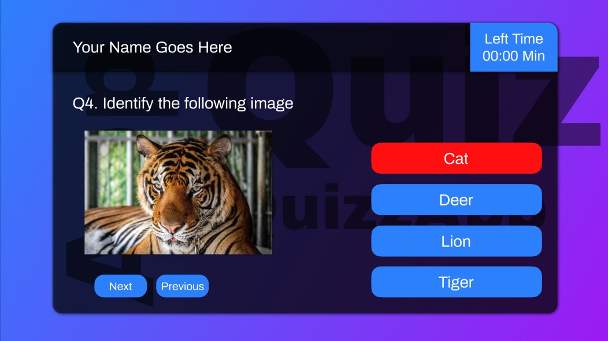
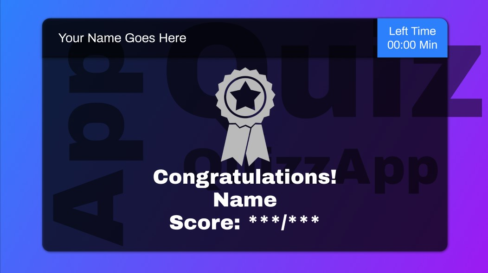

## Description
***
I want to make a Quiz Playing Web Application in which people can practice the questions and feel the pressure due to time limitation.

People can have different options like 
- 1 minutes/Question.
- 60 minutes/ 60 Questions

### Walkthrough 
---
- User will enter his/her name
- User will have to select the Subject for the quiz test
- User will have to choose the time boundation either:

    1.  1 minutes/Question.
    2.  60 minutes/ 60 Questions

Now user can start the Quiz test and the get the score according to the number of the questions

4 marks for every correct answer
-1 marks for every incorrect answer

---
## "QuizzApp" web  application UI concept
These Images are just glimpse of the Web App and made through prototyping in Figma
Image 1 : Landing page



Image 2 : What's inside 


Image 3 : At last


**This project is under construction**

If you like this repo then please drop a 🌟

## If you want to contribute you are good to go

# How to contribute?
Step 1. Fork the repository and copy it to your local server. 

To copy in your local server just copy the following code and paste it in your command prompt

```
git clone https://github.com/SujeetYT/QuizApp.git
```
Step 2. Make a new branch using the following command.

```
git checkout -b BranchName
```
Step 3. Make something relevent to the project Description.

Step 4. Push Changes.

```
git add *

git commit -m "Your Commit Message"

git push origin BranchName
```

Step 5. Make a pull request.

Now you are good to go!
